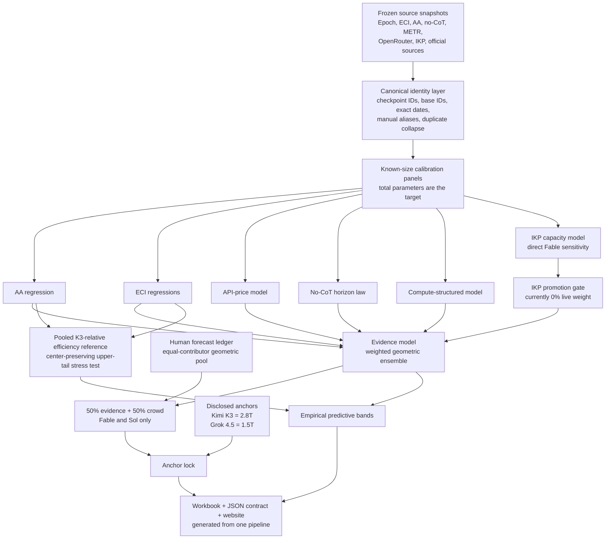

# Frontier Parameter Model

**Live website:** [Explore the interactive frontier model size estimates](https://anpaure.github.io/frontier-model-sizes/)

This repository estimates the implied **total base-parameter scale** of current frontier models from several independently audited signals. It combines benchmark performance, exact release dates, no-chain-of-thought task horizons, API pricing, compute structure, factual capacity, and human forecasts in log-parameter space. Disclosed parameter counts are hard-locked.

The headline estimates in the current snapshot are:

| Model / base | Evidence model | Crowd | Final |
|---|---:|---:|---:|
| Claude Opus 5 | 3.0T | — | **3.0T** |
| Claude Fable 5 | 4.7T | 4.4T | **4.5T** |
| GPT-5.6 Sol | 3.1T | 3.2T | **3.1T** |
| Kimi K3 | locked | — | **2.8T** |
| Claude Opus 4.7/4.8 shared base | 2.7T | not pooled | **2.7T** |
| GPT-5.5 | 2.3T | — | **2.3T** |
| GPT-5.6 Terra | 2.1T | — | **2.1T** |
| Claude Sonnet 5 | 1.6T | — | **1.6T** |
| GPT-5.6 Luna | 1.5T | — | **1.5T** |
| Grok 4.5 | locked | — | **1.5T** |

These are parameter-equivalent estimates, not claims to know the exact proprietary tensors. The target is total parameters rather than active parameters or inference-time compute.

The concise, pipeline-generated readiness and precision statement is [`MODEL_READINESS.md`](MODEL_READINESS.md). It is rebuilt from the audited artifacts and includes the current forecast intervals, held-out errors, validation extensions, and the immutable prospective commitment.

The unrounded generated centers are **4.7319T evidence / 4.5483T final for Fable**, **3.0810T evidence / 3.1457T final for Sol**, and **3.0038T evidence/final for Opus 5**. For Claude Opus 5, the stage audit trail is **3.2T direct AA/ECI estimate → 3.0T after weak price smoothing → 3.0T final**. There is no Opus 5 crowd pool, so the final center is the evidence-model center rather than a crowd/evidence blend.

## End-to-end architecture



This is Bayesian in spirit rather than a fully specified generative Bayesian model. Factor weights act like tempered likelihood powers in log-parameter space. Correlated or weak evidence is downweighted, retained as a zero-weight diagnostic, or rejected by held-out promotion gates.

## Prediction target and combination rule

The regression target is

```text
y = log10(total base parameters in billions)
```

All combinations are geometric. For estimates `P_i` and weights `w_i`:

```text
G(P, w) = exp(sum(w_i * ln(P_i)) / sum(w_i))
```

Log-space modeling reflects the multiplicative nature of parameter uncertainty and makes a 50/50 combination the geometric mean rather than the arithmetic mean.

## Source preservation and canonicalization

The current canonical unified dataset contains:

- 7,887 canonical observations;
- 19,515 canonical long-form measurements;
- 19 source-manifest entries;
- 3,574 current raw Epoch model records, plus separately labeled historical archive views;
- 2,059 ECI benchmark rows across 213 models and 54 benchmarks;
- 587 raw Artificial Analysis configurations, yielding 273 raw-snapshot open-weight checkpoints and 275 calibration checkpoints after two exact, hash-pinned primary-source openness corrections;
- 49 no-CoT checkpoints: 35 open-weight and 14 frontier/proprietary;
- 26 official METR rows and all 114 scaffold entries; and
- separately preserved OpenRouter model, provider, endpoint, tier, price-history, and throughput records observed through 2026-07-31; their generated filenames retain a legacy `2026-07-18` compatibility suffix.

The canonical megafile is rebuilt from the current 2026-07-31 Epoch and AA snapshots by `build_unified_model_data.mjs`. Its generated filenames currently retain legacy date suffixes for compatibility; the source manifest and embedded hashes, not the suffix, identify the data vintage. The current atomic source contracts are:

- [`epoch_snapshot_manifest_2026-07-31.json`](sources/epoch_snapshot_manifest_2026-07-31.json)
- [`aa_detailed_snapshot_manifest_2026-07-31.json`](sources/aa_detailed_snapshot_manifest_2026-07-31.json)
- [`kimi_k3_release_evidence_2026-07-31.json`](sources/kimi_k3_release_evidence_2026-07-31.json)

Every model-level row has a canonical checkpoint ID, canonical base ID, exact or audited release date, source identity, and match status. Unmatched or ambiguous rows are retained explicitly instead of silently dropped.

Identity rules include:

- duplicate AA configurations for one checkpoint collapse to the highest score;
- fuzzy model-level matching is prohibited;
- serving configurations do not become separate parameter labels;
- Opus 4.5–4.8 are represented as a shared post-training lineage, with a displayed Opus 4.7/4.8 base row;
- GPT-5 through GPT-5.5 are treated as a shared lineage, while GPT-5.6 targets remain separate;
- Fable and Mythos share underlying weights according to Anthropic's primary source; and
- Fable is not collapsed with Opus—the Opus fallback is serving behavior, not a shared-weight identity.

Claude Opus 5 has its own `unique_base` identity. This is a conservative modeling policy because Anthropic has not disclosed a same-weight relationship with Fable/Mythos or the Opus 4.x lineage; it is not a claim that Opus 5's architecture or parameter count is known.

### Claude Opus 5 evidence contract

`collect_claude_opus5_evidence.py` is executed by the ordinary pipeline and verifies the dated, hashed source bundle plus [`sources/claude_opus_5_evidence_2026-07-31.json`](sources/claude_opus_5_evidence_2026-07-31.json). It does not access the network or replace the frozen bundle unless `--refresh` is supplied explicitly.

The regression consumes these exact observed inputs:

- release date: `2026-07-24`;
- Artificial Analysis: `60.6918740157091`, selecting the highest exact Opus 5 row, `adaptive_reasoning_max_effort` (with Claude Opus 4.8 as the declared fallback);
- Epoch ECI: `159.3778667882398`, reproduced from all 12 canonical component rows, with a 90% interval of `157.24933114170264–162.20640578425878`; and
- standard API price: `$5/$25` per million input/output tokens. The `$10/$50` fast tier is preserved separately and is not substituted for the standard tier.

No Opus 5 parameter count, training compute, dense/MoE architecture, or active-parameter count is disclosed. METR, no-CoT, IKP, and crowd observations are also absent. Crowd and IKP are omitted. To preserve the pre-registered evidence composition, the unavailable horizon branch is neutralized at the price-smoothed center, so it produces no directional update; the UI labels that bookkeeping value as neutral rather than presenting it as an Opus 5 observation.

The direct benchmark stage is the geometric AA/ECI estimate (`3.2T` at display precision). Weak price smoothing moves it to `3.0T`; the remaining evidence aggregation and the absence of a crowd layer leave the final display at `3.0T`.

## Leakage-controlled evaluation

For each known-size test checkpoint, the preferred validation fold:

1. trains only on models released strictly before the test model;
2. excludes the test developer/family entirely;
3. predicts `log10(total parameters)`;
4. gives each training family approximately equal aggregate weight; and
5. reports multiplicative parameter error.

The main factor panels are:

| Factor | Known-size rows | Families |
|---|---:|---:|
| AA | 50 | 22 |
| ECI | 89 | 40 |
| No-CoT | 35 | 6 |
| Compute backtest | 312 | 119 |

These panels overlap and must not be summed. The conservatively matched combined backtest contains 44 distinct checkpoints across 25 families.

The exercise is pseudo-chronological: release dates and train/test membership are historical, but some benchmark measurements come from the current audited snapshots rather than true release-vintage captures.

## Live factor models

### Artificial Analysis

AA directly predicts total parameters from AA score and exact release date. The slope is trained on known open-weight models; Kimi K3 is withheld and then used to calibrate the intercept:

```text
P_AA = 2.780T * 10^(
    0.045205959 * (AA - 57.112339)
    - 0.350927951 * ((date - 2026-07-16) / 365.25)
)
```

At equal score, later models imply fewer parameters because the date term represents algorithmic improvement. The broader 94-model AA extension remains at 0% incremental weight because its frontier-like developer-held-out interval was neutral.

Current signals: Fable 4.1T; Sol 3.5T.

### Epoch ECI

ECI uses two direct parameter regressions.

```text
P_dated = 10^(
    3.458514155
    + 0.064297527 * ECI
    - 0.350927951 * ((date - 2023-01-01) / 365.25)
) / 1e12 T

P_no_date = 10^(
    5.704969833
    + 0.041808993 * ECI
) / 1e12 T

P_ECI = P_no_date^0.60 * P_dated^0.40
```

The 60/40 blend shrinks the unstable date coefficient rather than treating algorithmic progress as a known law.

Current signals: Fable 3.0T; Sol 3.4T.

### API price

The price index is

```text
z = sqrt(input price * output price) * tokenizer factor
```

The Anthropic tokenizer factor is 1.3; OpenAI uses 1.0. Across seven OpenAI/Anthropic frontier bases, a leave-one-base-out regression estimates

```text
log10(P) = intercept + slope * log10(z) + Anthropic fixed effect
```

The price-informed benchmark branch is

```text
P_commercial = sqrt(P_AA * P_ECI)^0.85 * P_price^0.15
```

This is a weak commercial-price smoother of the benchmark-implied scale, not an independent physical measurement of proprietary parameters. Separate OpenRouter known-size backtests support the sign and conservative weight. Tok/s and latency do not improve recovery after price and remain at 0%.

Current price signals: Fable 3.0T; Sol 2.9T.

### No-CoT horizon

The no-CoT paper reports that one task-horizon doubling corresponds to about 4.2× total parameters:

```text
alpha = log2(4.2) = 2.0704
P_horizon = 2.780T * (TH_target / TH_K3_equivalent)^alpha
```

The exact-date-adjusted no-CoT time-horizon doubling law is 365.9 days. All 49 paper checkpoints have day-level dates.

Target construction is model-specific:

- K3's pretrain-equivalent horizon is anchored to Opus 4.5 using Ryan Greenblatt's corrected assessment.
- Sol starts from the geometric mean of GPT-5.4 and GPT-5.5 no-CoT horizons and advances it to Sol's exact release date.
- Fable geometrically pools an Opus-4.5-to-Fable date projection with an eight-month K3-to-Anthropic pretraining-gap prior.
- Opus uses the geometric mean of Opus 4.5, 4.6, and 4.7 measurements.
- Terra and Luna preserve their benchmark ratios relative to Sol.
- Sonnet's horizon branch is neutral because there is no direct Sonnet 5 no-CoT point.

Current horizon signals: Fable 6.6T; Sol 3.0T.

METR receives 0% direct parameter weight. It is used to diagnose post-training leverage: Opus 4.5→4.6 changes only about 1.04× on no-CoT horizon while its with-CoT METR horizon changes about 2.45×. This is evidence that RL, inference, and scaffolding can move agentic performance substantially without requiring a larger base.

OpenAI's direct 3.6-minute Sol result is also retained at 0% incremental weight because defensible mappings of that single point range from 1.7T to 11.2T.

### Compute-structured prior

No live target has observed training compute, so the model predicts compute instead of treating it as measured.

1. On 31 exact AA↔Epoch checkpoints: `AA + date → log10(training FLOP)`.
2. On 19 confident/likely frontier-language Epoch rows: `log10(training FLOP) + date → log10(total parameters)`.

Both stages fit the primary variable and then correct residuals for exact date. Raw totals receive a geometric two-anchor calibration using K3 and Grok:

```text
calibration = sqrt(
    (2.780 / raw_K3) *
    (1.5 / raw_Grok)
)
```

Because this branch reuses AA and date and observes no disclosed target compute, it receives only 5% of the evidence model. K3 has one speculative Epoch compute estimate, but it is not treated as a primary-source target observation.

Current signals: Fable 2.6T; Sol 2.3T.

### IKP factual capacity

Incompressible Knowledge Probes fit factual accuracy against model size:

```text
IKP accuracy = intercept + slope * log10(P)
log10(P_target) = (target accuracy - intercept) / slope
```

Training uses strictly earlier open-weight models and excludes the target vendor. Ninety-three configurations collapse to 87 weight bases. On the exact 13-model/11-family overlap, IKP's median error is 1.68× versus 2.16× for the existing evidence model; a fixed 10% diagnostic blend has 1.80× median error. Both family-bootstrap intervals are favorable, but the later chronological subset contains only seven models across seven families. The predeclared gate requires at least eight models and seven families, so IKP is not promoted and receives 0% live weight.

Fable's strict pre-Fable, Anthropic-excluded estimate is 3.6T. Sol is absent from the pinned IKP evaluation, so no value is imputed.

## Exact live weights

The live evidence model is

```text
P_base_evidence = P_commercial^0.45 * P_horizon^0.50 * P_compute^0.05
```

Expanding the commercial branch gives:

| Factor | Baseline evidence weight |
|---|---:|
| AA | 19.125% |
| ECI | 19.125% |
| API price | 6.750% |
| No-CoT horizon | 50.000% |
| Compute | 5.000% |

Fable has a direct IKP sensitivity, but the failed chronological-coverage gate assigns it 0%. Its baseline evidence composition is therefore restored in full before the 50% crowd blend:

| Factor | Fable evidence weight | Fable final weight |
|---|---:|---:|
| AA | 19.125% | 9.5625% |
| ECI | 19.125% | 9.5625% |
| Price | 6.750% | 3.3750% |
| Horizon | 50.000% | 25.0000% |
| Compute | 5.000% | 2.5000% |
| IKP | 0.000% | 0.0000% |
| Crowd | — | 50.000% |

Sol has no IKP observation and uses the same live final weights:

| Factor | Sol final weight |
|---|---:|
| AA | 9.5625% |
| ECI | 9.5625% |
| Price | 3.3750% |
| Horizon | 25.0000% |
| Compute | 2.5000% |
| IKP | 0.0000% |
| Crowd | 50.0000% |

## Human forecast pool

[`sources/human_parameter_forecasts_2026-07-17.csv`](sources/human_parameter_forecasts_2026-07-17.csv) is the single editable crowd source.

The date in that filename is the durable ledger's creation date, not a claim that the respondent rows stop on 2026-07-17; revisions append to the same file and are selected by `supersedes`. Public records use stable anonymous IDs (`Respondent R01`–`Respondent R21`) and opaque forecast IDs. No name-to-ID mapping is retained in the project.

- Revisions append a new row and supersede the old forecast ID.
- Only one active forecast per respondent/model is allowed.
- A separately stated central estimate is used when present.
- Otherwise, a range `[low, high]` becomes `sqrt(low * high)`.
- Respondents receive equal log weight.
- The crowd center is the geometric mean of active contributor points.

The current pools are 20 respondents for Fable and 19 for Sol. Their final forecast is

```text
P_final = sqrt(P_evidence * P_crowd)
```

The crowd is an explicit judgmental layer. It is not treated as statistically independent evidence and does not narrow the empirical uncertainty intervals.

The generated robustness audit confirms that the center is not controlled by one respondent: leave-one-out final ranges are 4.45–4.73T for Fable and 3.08–3.27T for Sol. However, the 18 respondents who forecast both targets have a 0.77 correlation in log forecasts, and nearly all statements were relayed rather than collected under a blinded elicitation protocol. Agreement with the regression is therefore not an independent validation result. See [`CROWD_ROBUSTNESS_AUDIT.md`](CROWD_ROBUSTNESS_AUDIT.md) and [`POLL_RESPONDENT_PRIVACY.md`](POLL_RESPONDENT_PRIVACY.md).

## Anchors and missing factors

Kimi K3 and Grok 4.5 are disclosed anchors. K3's exact method value is 2.780T (104.2B activated); the one-decimal UI displays 2.8T. The forecasting function immediately returns 2.780T or 1.5T respectively, regardless of factor-slider settings.

For an unlocked target, unavailable evidence factors are renormalized *inside the evidence block*. A missing or zero-weight Fable-only signal therefore cannot silently change Sol's 50% crowd weight.

## Backtests and weight selection

The current available-component core ensemble has a 2.14× median multiplicative error on 44 strict chronological model-lineage-held-out predictions. The 27-row frontier-like subset is slightly better at 2.02×; replacing lineage exclusion with whole-developer exclusion gives 1.89× on the same frontier rows. These are the most relevant point-accuracy summaries for the hidden frontier targets.

Kimi K3 exposed and fixed an evaluation join bug. K3 is intentionally absent from the 50-row AA parameter-target panel so that it remains an external check, but its exact AA score was available. The old available-component join therefore evaluated K3 from ECI (449.8B) plus speculative compute (211.1B) alone, producing a misleading 384.5B / 7.23× row. The corrected audit adds a strictly earlier, all-Kimi-held-out AA prediction of 2.243T (1.24× error) without putting K3's disclosed size into the fit. Under the unchanged component weights, the corrected incomplete-component ensemble is 838.7B / 3.31×. Central forecasts do not change; the current diagnostic 80%/90% factors fall to 5.28×/6.19×. The immutable pre-disclosure freeze is not rewritten.

Parameter truth is reconciled before those errors are scored. Moonshot's publisher report supplies 1.040T total and 32.6B active parameters for the Kimi K2 weight family, while the official Hugging Face safetensors inventories give exactly 228.703644928B total and 10B active for each of MiniMax M2.5 and M2.7. The canonical overlay preserves every raw 1.0T/1.04T and 229B/230B source label, does not widen global matching tolerances, and does not deduplicate distinct checkpoints merely because they share a parameter truth. These corrections were not used to select a live weight after observing the resulting errors; they only make target labels consistent across validation views. The frozen source contract is [`open_model_parameter_truth_reconciliation_2026-07-31.json`](sources/open_model_parameter_truth_reconciliation_2026-07-31.json).

LongCat 2.0 receives a separate definition audit rather than a silent override. Meituan's 1.6T total/about-48B active disclosure remains canonical; Hugging Face's exact 1.775560491136T serialized inventory includes 136.94B MTP elements, and excluding them leaves 1.6386T, consistent with the publisher's rounded label. Using the serialized convention changes the legacy target fits by less than 0.9%, leaves the matched ensemble and live forecasts unchanged, and receives 0% weight. See [`LONGCAT_PARAMETER_DEFINITION_SENSITIVITY.md`](LONGCAT_PARAMETER_DEFINITION_SENSITIVITY.md).

Direct weight optimization was evaluated in an outer chronological procedure. On 32 genuinely eligible outer predictions:

| Weighting | Median error | Within 2× |
|---|---:|---:|
| Current weights | **2.14×** | **44%** |
| Equal weights | 2.15× | 41% |
| Nested optimized-MSE weights | 2.32× | 41% |
| Nested optimized-MAE weights | 2.44× | 38% |

For the primary nested MSE optimizer, optimized-minus-current mean absolute log10 error is `+0.0258`; its 90% family-bootstrap interval is `−0.0422` to `+0.0825`, with only a 25.24% bootstrap probability that optimization is better across 21 family clusters. The live weights remain conservative rather than overfitting sparse, differently covered factors.

See:

These filenames retain durable date suffixes. The backtest embeds `generated_on: 2026-07-31`; the optimizer records and hashes that current 44-row backtest as its input even though its own compatibility path and metadata retain `2026-07-18`. The JSON contents and recorded source hashes, not the filename suffixes alone, define the evaluated data.

- [`frontier_parameter_chronological_backtest_2026-07-17.json`](outputs/019f6c42-2d53-7743-ab07-6293e2618dd7/frontier_parameter_chronological_backtest_2026-07-17.json)
- [`factor_weight_optimization_2026-07-18.json`](outputs/019f6c42-2d53-7743-ab07-6293e2618dd7/factor_weight_optimization_2026-07-18.json)

The current Fable, Sol, and Opus 5 forecasts are also locked in a tamper-evident pre-disclosure artifact at [`forecast_freezes/2026-07-31-frontier-parameters-v1/forecast_freeze.json`](forecast_freezes/2026-07-31-frontier-parameters-v1/forecast_freeze.json). Every ordinary build verifies the artifact and its detached digest, but never rebuilds it; post-outcome refitting is forbidden by the stored evaluation policy.

### Epoch employee calibration challenge

An Epoch employee supplied an eight-row AA/ECI calibration sheet and suggested a leaner model with explicit MoE structure. The pipeline preserves the exact displayed values, resolves every row to the pinned AA, ECI, and Epoch sources, and reproduces all eight estimates. Three Kimi rows share one base lineage, leaving six independent base clusters; the panel is therefore treated as a structural challenge set rather than an iid holdout.

The critique is real: the benchmark-only branch has 3.23× median multiplicative error on those rows, and all five MoE rows are underpredicted on average. But a binary MoE flag is not a complete correction—the three dense rows range from one large inefficient checkpoint to two small efficient checkpoints and err in opposite directions.

Two lean candidates are evaluated automatically on the current 89-checkpoint/40-family ECI architecture panel:

| Candidate | Strict held-out rows | Median error | Equal-family 90% interval vs live ECI |
|---|---:|---:|---:|
| Live ECI 60/40 | 69 | 2.60× | baseline |
| Score + date + MoE | 69 | 2.29× | −0.103 to +0.036 log10 |
| Active parameters, then dated sparsity | 63 | 2.32× | −0.083 to +0.102 log10 |

Both candidate intervals cross zero, their MoE-only intervals also cross zero, and both fail the complete promotion gate. They remain 0%-weight diagnostics. Removing price changes the final Fable and Sol estimates by only +0.90% and +0.29%, respectively, so price is not the cause of the calibration miss. The full record is in [`EPOCH_EMPLOYEE_FEEDBACK_AUDIT.md`](EPOCH_EMPLOYEE_FEEDBACK_AUDIT.md).

A separate aggregate-ECI challenger fixes the architecture specification in advance of each fold rather than selecting benchmark components. Across 69 strictly chronological whole-developer-held-out rows, adding MoE and reasoning indicators changes median error from 2.54× to 2.36×; on 46 frontier-like rows it changes 2.55× to 2.50×. This is not promotion-grade: within-2× accuracy worsens, the nested frontier interval crosses zero, the Kimi K3 error worsens from 6.27× to 6.68×, and no hidden target has independently observed architecture. Its live weight is 0%; details are in [`ECI_ARCHITECTURE_BLEND_CHALLENGER.md`](ECI_ARCHITECTURE_BLEND_CHALLENGER.md).

### Vintage ECI validation

A separately pinned July 22 Epoch capture extends the frozen historical validation without changing the selection archive. The unchanged live 60/40 ECI form has 1.46× median error across four retrospective interval targets—Kimi K2.5, Kimi K2.7 Code, Grok 4.5, and timestamp-rescued GLM-5.2—and all four are within 2×. Kimi K3's later ECI score produces a 2.05× miss, but it is a score-vintage check rather than a project-prospective parameter forecast because K3's size was already known.

The stronger benchmark-specific knowledge-residual idea was also replayed against 15 archived Epoch vintages with nested chronological whole-developer holdout. It improves median error from 3.65× to 3.52× on 18 targets, but only five developers are represented, the genuinely interval-prospective subset is two Moonshot models, and Fable/Sol expose only one/two selected knowledge benchmarks. It therefore remains at 0% live weight. See [`ECI_HISTORICAL_VALIDATION_EXTENSION.md`](ECI_HISTORICAL_VALIDATION_EXTENSION.md) and the generated `eci_vintage_knowledge_residual_audit_2026-07-31.json`.

Chronological parameter validation also distinguishes model release from the later date on which the target parameter count became public. Six recent AA checkpoints now have a hash-pinned timing ledger; first-party launch disclosures are retained when they precede downloadable weights. The isolated label-timing audit originally moved the strict AA median from 2.66× to 2.50× and one ensemble residual by 0.41%; those figures are retained as the historical counterfactual, not current precision after the later truth and score-timing overlays. Live centers and weights remain unchanged. See [`AA_PARAMETER_LABEL_TIMING_AUDIT.md`](AA_PARAMETER_LABEL_TIMING_AUDIT.md).

AA benchmark scores have a separate information clock. The pinned official changelog verifies first non-null Intelligence Index dates for 28 of the 50 live AA calibration rows; 16 became available after nominal model release, while 22 unmatched rows retain release-date fallback and are explicitly unverified. With the reconciled parameter truths fixed in both arms, applying the verified dates changes the all-ensemble validation from 43 rows/2.15× median error to 44 rows/2.14× and the frontier subset from 26 rows/2.09× to 27 rows/2.02×. AA alone becomes slightly worse, so this is retained as an information-set correction rather than a favorable-result filter. Current AA scores are still a present-day snapshot, not fully reconstructed historical score vintages. See [`AA_SCORE_AVAILABILITY_TIMING_AUDIT.md`](AA_SCORE_AVAILABILITY_TIMING_AUDIT.md).

## Predictive uncertainty

Uncertainty is calibrated separately from the central forecast. The 27 frontier-like backtest rows span 16 model-series lineages but only 11 canonical developers. The current audit recomputes both model-lineage- and whole-developer-held-out predictions, retains the largest error when one developer has multiple checkpoints on its latest information date, and publishes the conservative per-level envelope. These are empirical prequential error bands, not formal split-conformal guarantees. The target-chronological 50% bands are approximately:

- Fable evidence center: 2.0–11.3T
- Sol evidence center: 1.0–9.9T

The current frontier-cohort envelope factors are `3.02×`, `5.28×`, and `6.19×` at 50%, 80%, and 90%. The descriptive 50% level remains target-chronological—2.38× for Fable, 3.22× for Sol, and 3.02× for Opus 5—while the conservative 80% factor is 5.276400× for every target. The 80% bands are 0.9–25.0T for Fable, 0.6–16.3T for Sol, and 0.6–15.8T for Opus 5. Sequential coverage is reported by raw checkpoint, equal developer, and latest developer; most early 90% ranks are correctly marked unsupported instead of clipping to a finite maximum. The chart omits error bars, but the uncertainty artifact remains available at [`frontier_parameter_predictive_uncertainty_2026-07-18.json`](outputs/019f6c42-2d53-7743-ab07-6293e2618dd7/frontier_parameter_predictive_uncertainty_2026-07-18.json). Its filename is a compatibility path; the embedded `generated_on` date is 2026-08-01.

### K3 parameter-efficiency upper-tail stress test

The user-supplied assumption “the frontier labs are at least as parameter-efficient as Kimi K3” is now live as a center-preserving **upper-tail stress test**. It is not another independent AA/ECI factor and has 0% point-center weight. Conditional on any one capability-to-size map, equal or better parameter efficiency means:

```text
P_target <= 2.780T * 10^(slope * (score_target - score_K3))
```

Target and K3 dates are held equal in this comparison: the statement being tested is parameter efficiency itself, not a second date-progress adjustment. The retained laws are already linear in `log10(parameters)`, so performance is logarithmic in raw parameter count and diminishing returns are already present. The rejected quadratic/ridge ECI challenger receives exactly 0% weight; the earlier 8.5–12.2T result came from unvalidated convex extrapolation plus transporting K3's full residual, not from a valid diminishing-returns calculation.

The direct equal-efficiency equivalents are:

| Target | AA | Canonical ECI | Pooled reference median | Reference 10–90% |
|---|---:|---:|---:|---:|
| Claude Fable 5 | 3.7T | 5.1T | 4.1T | 3.6–4.9T |
| GPT-5.6 Sol | 3.3T | 5.7T | 3.9T | 3.4–4.6T |
| Claude Opus 5 | 4.0T | 4.3T | 4.0T | 3.5–4.6T |

The reference distribution propagates the published ECI score intervals and five retained log-linear slope specifications. AA and ECI are pooled with equal log weight but explicitly treated as correlated alternative mappings, not independent likelihoods. Their geometric mean is a judgmental pooled parameter equivalent, not a strict logical ceiling under either mapping. The five slope specifications are sampled uniformly as sensitivities, not learned posterior model probabilities. AA score/slope and within-fit ECI coefficient uncertainty are not propagated. The user's `Sol < Fable` judgment projects only Sol's reference draws; it neither alters the centers nor enforces actual-size ordering.

At the default 80% projection strength, only upper-half uncertainty draws are winsorized. The raw 80% bands remain published and unchanged, while the projected stress-test bands become 0.9–5.5T for Fable, 0.6–4.7T for Sol, and 0.6–4.8T for Opus 5. Every lower endpoint, point center, chart bar, and the exact 50% Fable/Sol crowd weight remains unchanged. Fable's pooled reference is below its 4.7T evidence center in about 84% of draws. In those draws the center explicitly overrides the reference; the pipeline reports that rate rather than pretending the reference was enforced or silently pulling Fable downward.

These projected bands are center-preserving winsorized structural sensitivities—not literal conditioning, empirical coverage intervals, conformal intervals, or formal Bayesian credible intervals. The default 80% strength is an explicit judgmental setting and can be varied from 0% to 100% in the site. A truly hard efficiency constraint would have to move Fable's center when the reference falls below it. The source contract and full draw ledger are [`K3_EFFICIENCY_PRIOR_AUDIT.md`](K3_EFFICIENCY_PRIOR_AUDIT.md) and [`k3_efficiency_prior_2026-08-01.json`](outputs/019f6c42-2d53-7743-ab07-6293e2618dd7/k3_efficiency_prior_2026-08-01.json).

Claude Opus 5's `3.0T` is a central parameter-equivalent estimate, not a disclosed count or a narrow confidence claim. Applying the same framework gives an inherited 50% empirical range of `1.0–9.1T` and an 80% range of `0.5–18.6T`. These are cross-model calibration bands, not Opus-5-specific residual estimates; the missing METR, no-CoT, IKP, and crowd observations do not narrow them. Rounding the center to one decimal place should not be read as precision.

This uncertainty correction and the later K3-efficiency sensitivity were completed after the immutable v1 pre-disclosure forecast freeze. Neither alters a central forecast or rewrites the freeze; the artifacts explicitly record the later diagnostic layers so the original commitment remains auditable.

## Retained zero-weight diagnostics

The following evidence is preserved and tested but currently receives 0% incremental weight:

- METR with-CoT horizons;
- OpenAI's direct Sol 3.6-minute no-CoT point;
- IKP factual-capacity transport to Fable (3.6T sensitivity; failed 7-versus-8 chronological-model coverage gate);
- tok/s, latency, and request-weighted operational measurements;
- active-parameter-to-total transport;
- the statistically favorable high-sparsity direct/active shrinkage challenger, because target sparsity is unobserved and the rule was not prospective;
- multivariate ECI component models;
- the aggregate-ECI MoE/reasoning challenger: its fixed 69-row median improves from 2.54× to 2.36×, but within-2× accuracy worsens, the nested frontier interval crosses zero, Kimi K3 degrades from 6.27× to 6.68× error, and the hidden targets' architecture is unobserved;
- the archive-vintage ECI knowledge-residual challenger;
- AA inference-budget corrections;
- the broader 94-model AA extension;
- post-training lineage correction;
- separate historical-price and active-price likelihoods; and
- the no-CoT architecture elasticity: 8.1323× is the paper-reproducing Pareto factor from its raw parameter labels, while 8.3199× is the canonical-truth sensitivity used by predictive fits and same-parameter controls.
- the LongCat serialized-element convention: 1.7756T including MTP tensors versus the canonical publisher-defined 1.6T model total.

These branches are not discarded. They remain provenance-preserving diagnostics and are promoted only if their chronological developer/family-held-out gates pass.

## Rebuilding everything

The ordinary frozen-source build is:

```bash
./run_forecast_pipeline.py
```

It:

1. verifies frozen source hashes;
2. reproduces ECI from Epoch's pinned implementation;
3. rebuilds the canonical unified data;
4. reruns factor audits and held-out tests;
5. regenerates the forecast workbook;
6. regenerates the website's normalized JSON contract;
7. runs an independent reaudit;
8. recalibrates uncertainty and weight diagnostics; and
9. builds and tests the rendered site.

Live upstream refreshes are explicit rather than automatic. Relevant flags include:

```bash
./run_forecast_pipeline.py \
  --refresh-aa \
  --refresh-openrouter \
  --refresh-openrouter-history \
  --refresh-hf-configs \
  --refresh-no-cot-dates \
  --refresh-frontier-primary \
  --refresh-metr \
  --refresh-ikp
```

For automatic rebuilds while editing the crowd ledger:

```bash
./run_forecast_pipeline.py --watch
```

The website is not a second implementation of the model. It reads [`site/public/data/forecast-model.json`](site/public/data/forecast-model.json) and applies the same log-space combination function. [`generate_parameter_scatter_data.py`](generate_parameter_scatter_data.py) then deterministically projects that contract into the ten-row forest-plot dataset at [`site/public/data/parameter-scatter.json`](site/public/data/parameter-scatter.json); no external chart data enters it. The fixed 1–7T default axis, expandable evidence controls, identity collapses, locked anchors, and live default centers are covered by rendered and data-contract tests. The build fails if the default website calculation and workbook disagree by more than `1e-9`.

For a shorter operational description, see [`FORECAST_PIPELINE.md`](FORECAST_PIPELINE.md).
